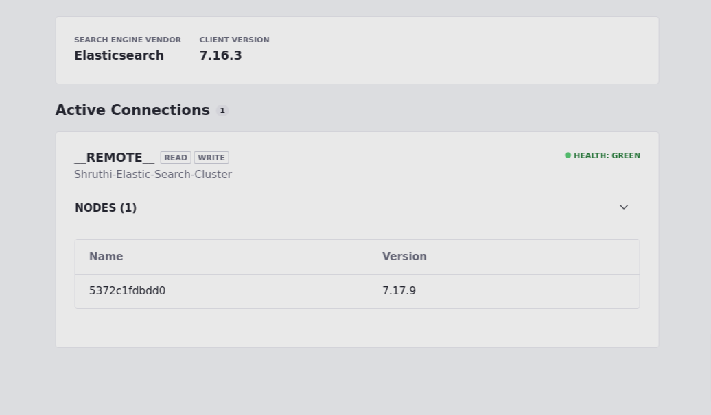

1. Download a **Liferay bundle** locally and unzip the bundle.

2. Navigate to Liferay home. Start Tomcat server with ./catalina.sh run, the path you need to navigate to start the server looks similar to this path but depends on where you have unzip Liferay bundle initially. 
```
/home/me/Documents/liferay-dxp-7.4.13.u70/tomcat-9.0.71/bin 
```

3. As soon as your Tomcat server starts , you will be redirected to the **localhost** on your default browser, you can update the basic configurations and **save** it. You get an warning **"This instance is not registered"**, that means you need to add an **Activation key**.

4. You need to add an **Activation key** for the liferay instance to run successfully. You can download it from here: 
```
http://localhost:8080/c/portal/license_activation 
```
Download **developer key**. You need to add this activation key in the **deploy** folder of Liferay home. As soon as you add the **Activation key**, the logs reflect the messages: 
- **Processing activation-key**
- **DXP Development license validation passed**
- **License registered for DXP Development**

5. For my practise, I have spinned up a **elasticsearch:7.17.9** docker container and have set it up using command:
```
docker run -d --name elasticsearch -p 9200:9200 -e "discovery.type=single-node" elasticsearch:7.17.9
```
Check [compatability metrix](https://www.liferay.com/compatibility-matrix) to see support for the specific Liferay bundle downloaded.

6. Create the following Elasticsearch configuration file.
```
com.liferay.portal.search.elasticsearch7.configuration.ElasticsearchConfiguration.config
```

5. Specify the configuration properties in the **.config** file created in the previous step. This step enables remote operation mode.
```
networkHostAddresses=["http://localhost:9200"]
productionModeEnabled=B"true"
```

6. Place the **.config** file in your **[Liferay Home]/osgi/configs** folder.

7. Instead of **step 5 and step 6**, you can also set up configurations in the user interface. In the Global menu, go to **Control Panel --> System Settings --> Open Search category--> type Elasticsearch 7**. You can check/update following configurations:
- Operation Mode - Remote
- Network Host Addresses - http://localhost:9200 [ip address of your elasticsearch docker container]
- Production Mode Enabled - True
- Cluster Name - Shruthi-Elastic-Search-Cluster [cluster name of your choice provided in elasticsearch.yml file]

8. Congratulations! you have now **configured Liferay with Remote Elastic Search**. To check for elasticsearch health status, navigate to **Control Panel --> Search --> Connections**.
 
